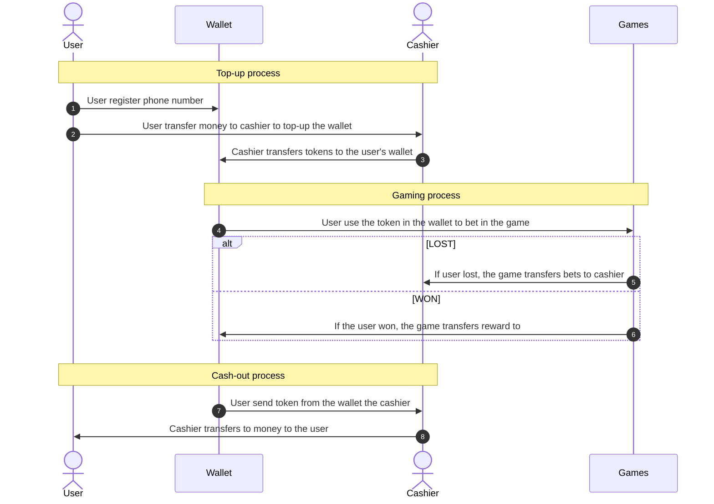
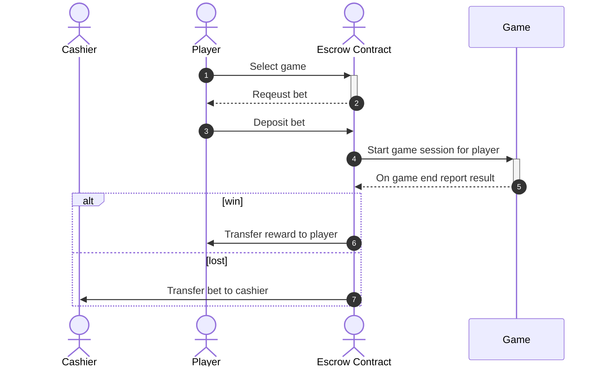

# Game Gallery With Digital Asset Wallet

## Payment Process

```mermaid
sequenceDiagram
    autonumber

    actor A as User
    participant B as Wallet
    actor C as Cashier
    participant D as Games

    rect rgba(255, 255, 255, 0.2)
    Note over A,C: Top-up process
    A ->> B: User register phone number
    A ->> C: User transfer money to cashier to top-up the wallet
    C ->> B: Cashier transfers tokens to the user's wallet
    end
    rect rgba(255, 255, 255, 0.2)
        Note over B,D: Gaming process
        B ->> D: User use the token in the wallet to bet in the game
        alt LOST
            D ->> C: If user lost, the game transfers bets to cashier
        else WON
            D ->> B: If the user won, the game transfers reward to
        end
    end

    rect rgba(255, 255, 255, 0.2)
    Note over A,C: Cash-out process
    B ->> C: User send token from the wallet the cashier
    C ->> A: Cashier transfers to money to the user
    end

```

## Gaming Process

```mermaid
sequenceDiagram
    autonumber
    actor A as Cashier
    actor B as Player
    actor C as Escrow Contract
    participant D as Game

    B ->>+ C: Select game
    C -->>- B: Reqeust bet
    B ->> C: Deposit bet
    C ->>+ D: Start game session for player

    D -->>- C: On game end report result
    alt win
        C ->> B: Transfer reward to player
    else lost
        C ->> A: Transfer bet to cashier
    end
```
