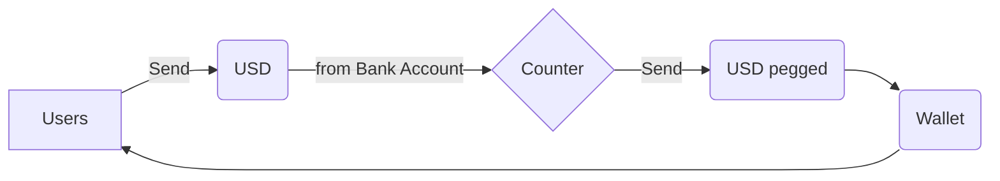
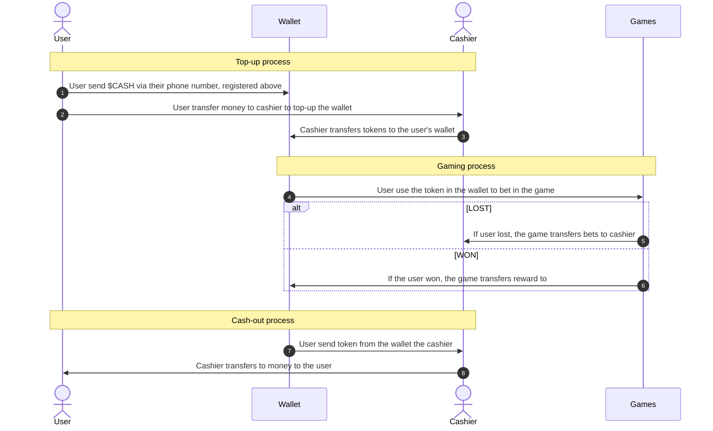
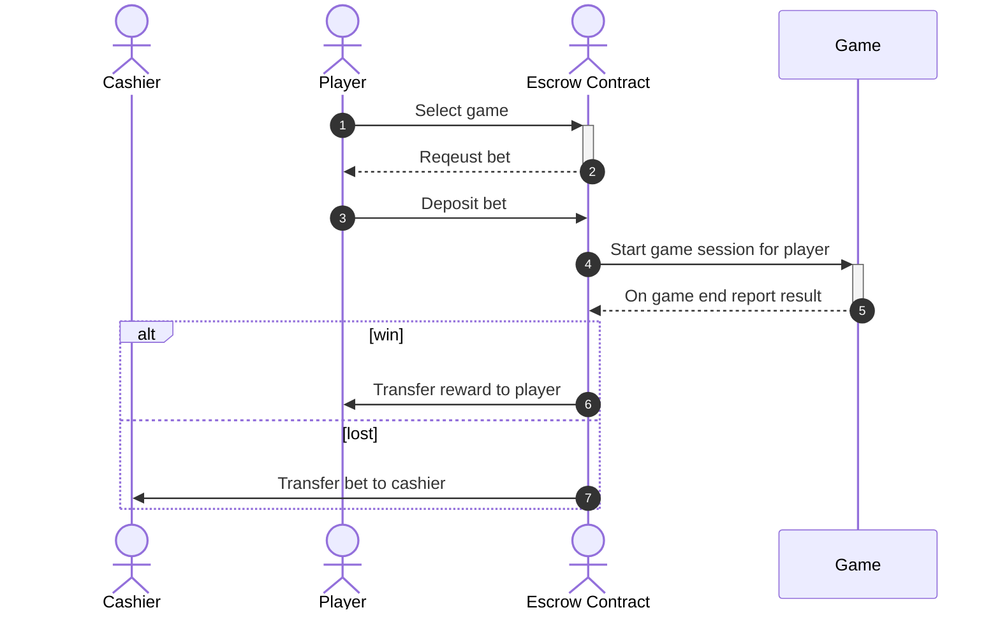
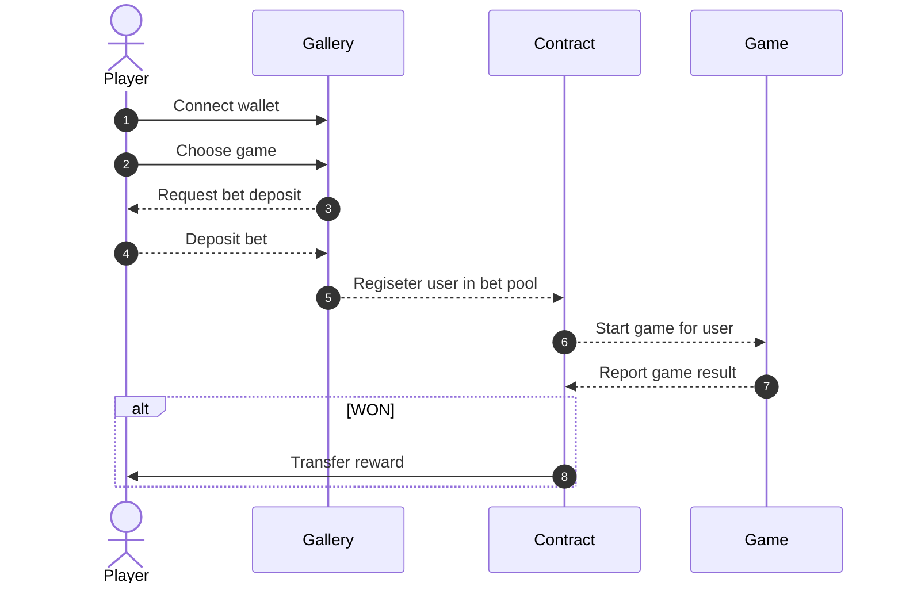

# Web3 Game 
A digital assets wallet management development for eSport and Entertainment Industry.

## Description of Request

A closed loop wallet system, which has the capacity to hold multi-currencies  as well as to receive funds from other source such as bank. 

The wallet will have to be numbered or segregated by the Phone number of the customer. Customers phone number is the account number in the wallet. 

After the wallet is segregated by individual wallet for customers one wallet will be for segregating the revenue

The wallet has to be secure and protected from hacking etc.

Capability to connect to a spot crypto exchange and the PSP at a later stage

Example: 

# Proposition

We propose that the wallet holds three different types of currencies/tokens; 

1. KHR pegged which is 1:1 exchange rate to U.S dollar. The customers could buy for their wallet by depositing KHR from their bank account to the wallet via payment service provider to the **Counter** 

2. USD pegged which is also 1:1 exchange rate to USD. Customer acquire this token same as above.

3. Game Token which will have the exchange rate in the future, the more people using and holding it. It could be a speculative investment with some utility. 

Thus, there will not be any exchange rate for the first two, as the transfer is in the same currency from the customer’s bank account to the customers wallet. 

## Game Token Utility

- As Discount and VIP privilege: Users or customers who hold X amount of the Game Token, will be charged less in transaction fees within the game. 

- As APY return: Users who hold the Game Token could also stake it to the game and earn APY in Game Token. 

- As Investment Asset: Users could cash out to other currencies or crypto at open exchange. 

## KHR and USD pegged utility

Wallet users could utilized these pegged currency to bet in the game, pay each others, receive rewards, or cash out to their bank accounts outside of the wallet.  

## Benefits for Game Operators

For Game Operator, the wallet allow them to hold customers' money within their phone, while the custom cash has already deposited to the Game Operator's bank account.

The cash only return back to the customers when they need to cash out. Though, since the wallet will have the capacity to transfer among themselves and make payment outside, the customer will less likely to take the cash out, but use it for game or buy things at the Operators' partnership stores. 

## Benefits for Users

## Technology

We will use blockchain to mint and burn the tokens needed. Mint is taken place, when customers transfer cash from their bank account to buy currency for wallet. Burn is taken place, when they transfer token back to their bank account.

We will use smart contract to automate these tasks and some others 

## Game Gallery Example

## Payment Process

## Gaming Process

## Gallery Interaction

# Question to Clarify

- Is the existing game system already in place? 

- If so, we do need access to the games in order to understand how integrate the wallets and estimate the time it will take to do it?

- How many tokens/currencies do you need to develop? Please help clarify its nature, for example; stable value 1:1 USD. 

